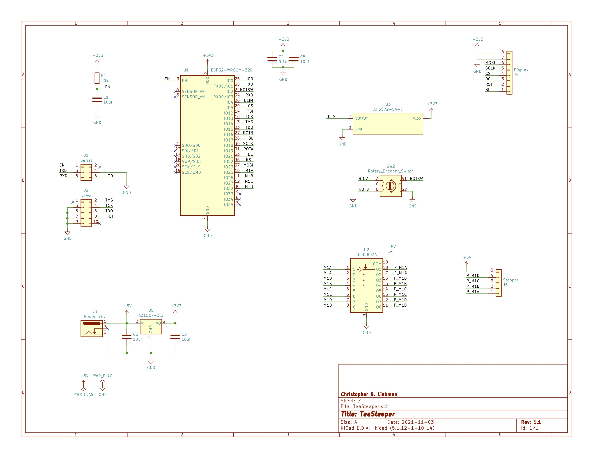

# TeaSteeper

TeaSteeper is a simple device to prevent tea from being over steeped.

- [src](src) contains firmware sources
- [kicad](kicad) contains [KiCad](https://www.kicad.org/) design files
- [enclosure](enclosure) contains [FreeCad](https://www.freecadweb.org/) and STL files for the enclosure.
These are designed for a FDM printer with a .4mm nozzle and .2mm layer height.

## Firmware

This project uses [PlatformIO](https://platformio.org/) to build firmware.

## Schematic

